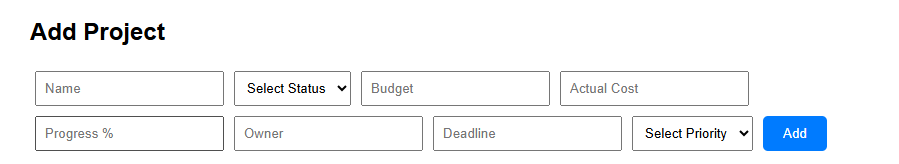
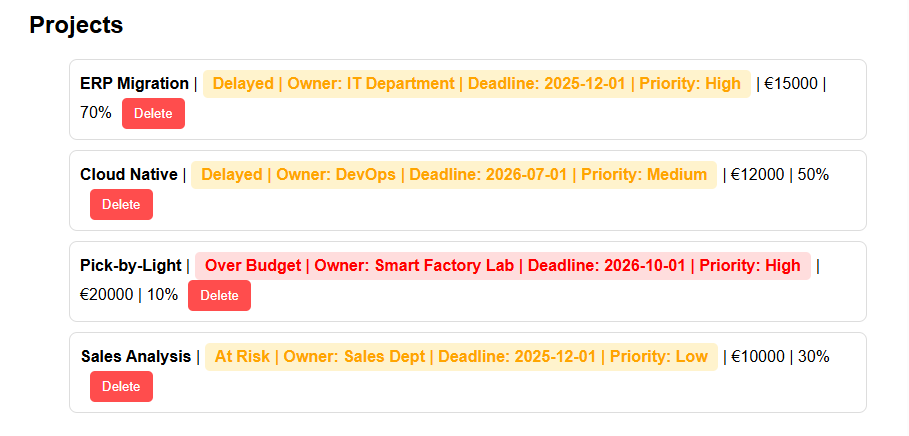
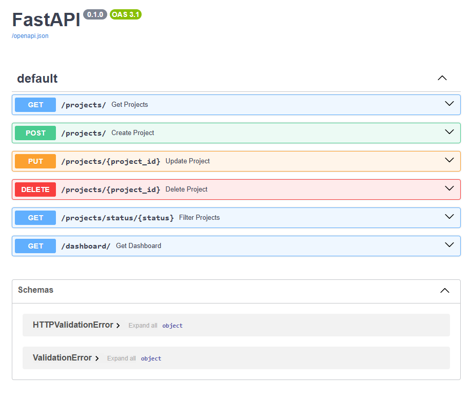

# IT Project Portfolio Tracker

## Overview

The IT Project Portfolio Tracker is a full-stack web application designed to simulate project governance and portfolio management in an IT environment.

The application enables users to:
- Track project progress
- Monitor project budgets
- Identify over-budget projects
- View portfolio-level dashboard metrics
- Manage project information in a centralized system

---

## Features

- Full CRUD operations
- Dashboard analytics
- Budget tracking
- Project status classification
- Portfolio filtering
- Priority management
- Responsive frontend dashboard
- REST API with FastAPI
- SQLite database integration

---

## Project Structure

```text
it-project-portfolio-tracker/
│
├── backend/
│   ├── main.py
│   ├── models.py
│   ├── database.py
│   ├── routes/
│   └── services/
│
├── frontend/
│
├── docs/
│   └── images/
│
├── README.md
└── requirements.txt
```

---

## Screenshots

### Dashboard


---

### Filtering Feature



---

### Project List



---

### API Documentation



---

## Installation

### Backend Setup

```bash
cd backend

python -m venv venv

# Windows
venv\Scripts\activate

pip install -r requirements.txt

uvicorn main:app --reload
```

---

### Frontend Setup

```bash
cd frontend

npm install

npm start
```

---

## API Endpoints

| Method | Endpoint | Description |
|---|---|---|
| GET | /projects/ | Get all projects |
| POST | /projects/ | Create project |
| PUT | /projects/{id} | Update project |
| DELETE | /projects/{id} | Delete project |
| GET | /dashboard/ | Dashboard metrics |
| GET | /projects/status/{status} | Filter by status |

---

## Future Improvements

- Authentication & authorization
- Docker containerization
- Chart visualizations
- Role-based access
- PostgreSQL integration
- CI/CD pipeline